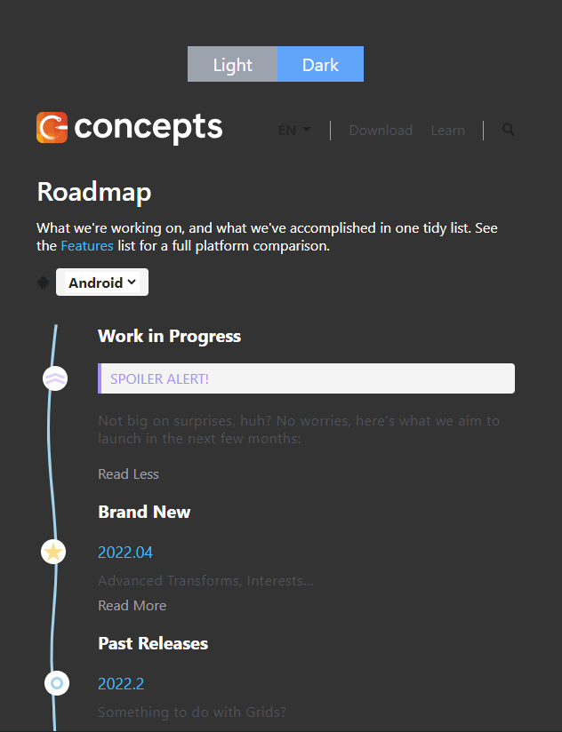

# Project: Roadmap UI Building

## Description
Build a frontend page for the roadmap

## Requirements
- Implement the UI components based on the following design(deployed version - https://roadmap-beta.vercel.app/).

- Implement the light/dark theme functionality.
- Implement proper all the buttion functionalities.
- Implement the alighment for the position and color themselves.
- Impelemnt the line rendering that is set based on the height of the main content.
  - Use useWindowSize hook to handle that.

## Screenshots





## Frontend
### Tech Stacks
- React
- TypeScript
- Vite

## Installation

1. Clone the repository

2. Set up the node modules on both front end and back end side
- Please use Node 16.14.0

```shell
npm install
```

3. Run the program

- Front-end

```shell
npm run dev
```

4. Open your web browser and visit `http://127.0.0.1:5173/` to see the application running.